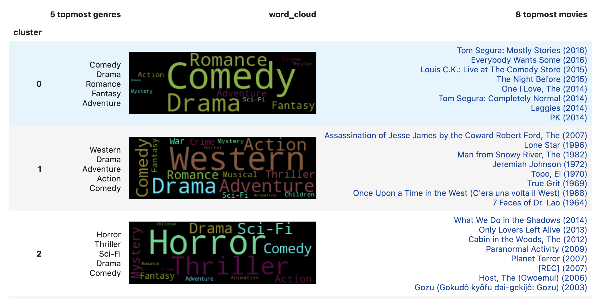

<div align="center">
  <h1>MovieLens : Système de recommendations</h1>
  
</div>

<br>

Projets fait dans le cadre des cours 420-A56 - Transformation et manipulation des données et 420-A58 - Algorithmes apprentissage non supervisé au Collège Bois de Boulogne. [Base de données utilisée](https://tinyurl.com/bdhmcfht).

## Directives pour reproduire les résultats:

1. Veuillez installer les modules python trouvés dans **requirements.txt**.

```console
pip install -r requirements.txt
```

2. S'assurer que le répertoire courant est celui contenant ce fichier lors de l'exécution des notebooks Jupyter.

3. Lancer A56.ipynb en premier.